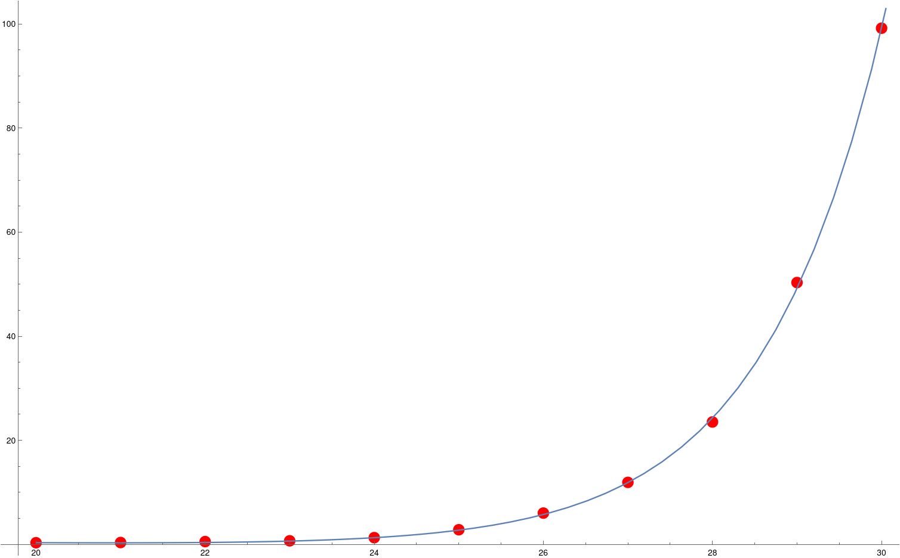

# Algorithm Patterns

An implementation of the `backtracking` and `greedy` algorithm patterns in Java using the backpack problem (with freights consisting of key-value-pairs) as an example.

## Benchmarking Backtracking

It is easy to see, both by calculation and by looking at the benchmark results, that from n to n+1 the runtime of the backtracking algorithm approximately doubles.
This means that the runtime measured by the Rumetime-Test corresponds to the recurrence of 2<sup>n</sup> - 1 and also to the total number of permutations of a bit string of 2<sup>n</sup>.

We determine the constant c that is defined by our program using linear regression with the benchmark data (variable is called x instead of n) using Mathematica:
```!
data = {{20, 0.32}, {21, 0.36}, {22, 0.54}, {23, 0.69}, {24, 1.30}, {25, 2.82}, {26, 6.025}, {27, 11.92}, {28, 23.53}, {29, 50.32}, {30, 99.2}};

DesignMatrix[data, {1, x}, x]

parabola = Fit[data, {1, x, 2^x}, x]

Show[ListPlot[data, PlotStyle -> Red], Plot[{parabola}, {x, 20, 31}]]

f(x) = 2.77737 + 9.35302*10-8 2x - 0.124682x
```


